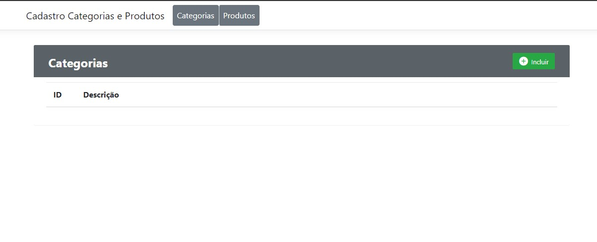

<h1 align="center">
    
</h1>

  <a href="#tecnologias">Tecnologias</a>&nbsp;&nbsp;&nbsp;|&nbsp;&nbsp;&nbsp;
   <a href="#descrição">Descrição</a>&nbsp;&nbsp;&nbsp;|&nbsp;&nbsp;&nbsp;

 
 

## 💻 Tecnologias

Esse código foi desenvolvido com as seguintes tecnologias:

-[C# .Net Core 2.2] 

## ✍ Descrição

Script para criar o banco de dados se encontra em (Solution>>Infrastructure>>SQL)

Para Configurar Banco de dados alterar o Arquivo appsettings.json que se encontra em (Solution>>Interface>>appsettings)
